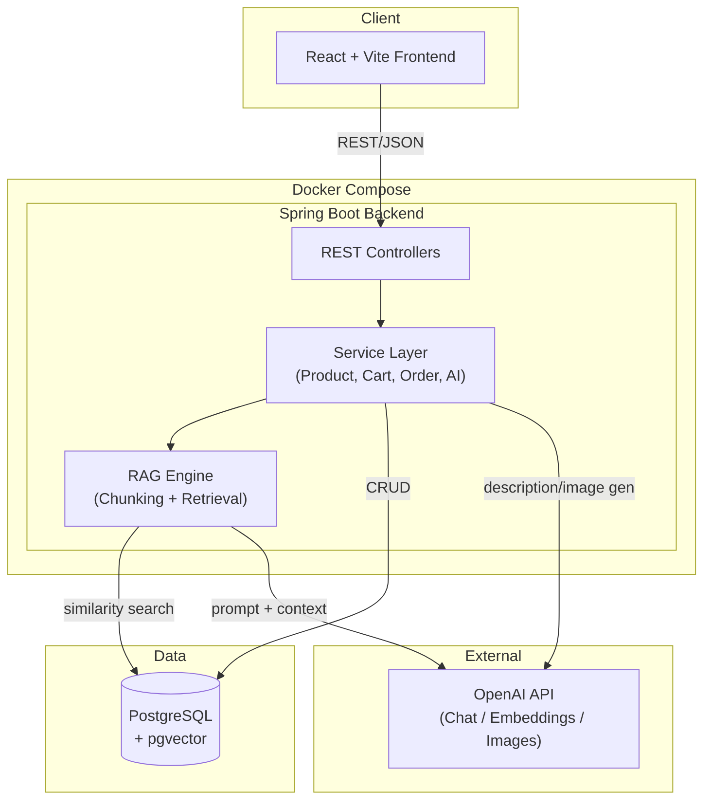
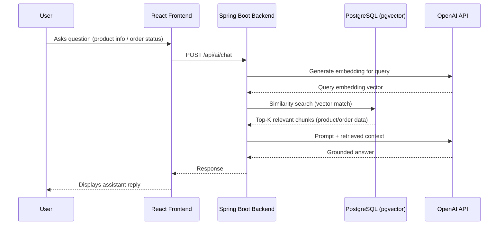
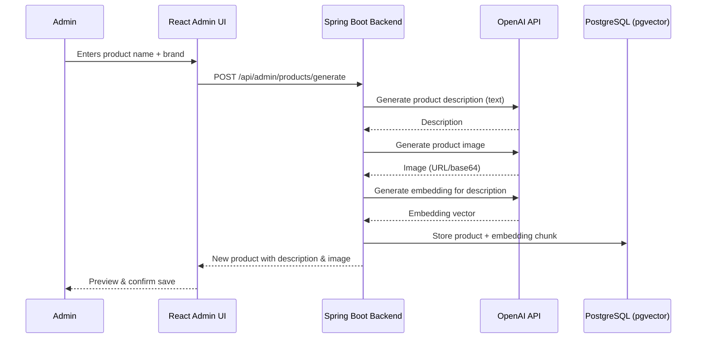

# AI-Powered E-Commerce Platform

A full-stack e-commerce application with integrated AI capabilities — AI-generated product content for admins and a Retrieval-Augmented Generation (RAG) chat assistant for customers to ask about products and track orders.

> **Note:** This README is structured as a template based on the project description provided. Adjust package names, exact dependency versions, and endpoint paths to match your actual implementation.

---

## Table of Contents

1. [Executive Summary](#executive-summary)
2. [Project Objective](#project-objective)
3. [Features](#features)
4. [Technologies Used](#technologies-used)
5. [Dependencies Used](#dependencies-used)
6. [System Architecture](#system-architecture)
7. [API Specification](#api-specification)
8. [Installation and Project Folder Structure](#installation-and-project-folder-structure)
9. [Environment Variables](#environment-variables)
10. [License](#license)

---

## Executive Summary

This project is a modern e-commerce platform that combines a **React + Vite** storefront with a **Spring Boot** backend, enhanced by **OpenAI**-powered AI features. Customers can search and browse products, manage their cart, check out, and track orders — with an AI chat assistant available at every step to answer product questions or provide order status updates.

On the admin side, product creation is accelerated with AI: given just a product **name** and **brand**, the system generates a marketing-ready **product description** and a matching **product image**.

The AI layer is powered by a **Retrieval-Augmented Generation (RAG)** pipeline: product and order data is chunked, embedded, and stored in **PostgreSQL with the `pgvector` extension**, allowing the assistant to ground its answers in real product/order data rather than hallucinating responses. The entire stack — frontend, backend, database, and vector store — is containerized with **Docker** for consistent local development and deployment.

---

## Project Objective

The primary objectives of this project are to:

- Build a fully functional e-commerce platform with standard customer flows: search, cart, checkout, and order tracking.
- Reduce admin workload by using AI to auto-generate product descriptions and product images from minimal input (name + brand).
- Provide customers with an intelligent, context-aware chat assistant that can answer product questions and order-status queries using RAG rather than generic LLM responses.
- Demonstrate a production-style AI integration pattern: chunking → embedding → vector storage (pgvector) → retrieval → grounded generation (OpenAI).
- Containerize the full stack with Docker so the application can be spun up consistently across environments.

---

## Features

### Customer-Facing Features
- **Product search** — keyword-based search across the product catalog.
- **Product browsing** — view product listings and detail pages.
- **AI product Q&A** — ask the assistant questions about a specific product; answers are grounded via RAG over product data.
- **Cart management** — add, remove, and update product quantities in the cart.
- **Checkout** — place an order from the current cart contents.
- **Order history & details** — view past and current orders and their status.
- **AI order-tracking assistant** — ask the chat assistant about the status of an order in natural language.

### Admin Features
- **AI-assisted product creation**:
  - Input: product **name** + **brand**.
  - Output: AI-generated **product description** (via OpenAI text generation).
  - Output: AI-generated **product image** (via OpenAI image generation), associated with the description.
- **Product management (CRUD)** — create, edit, update, and delete products.
- **Order management** — view and manage customer orders.

### AI / RAG Capabilities
- **Data chunking** — product and order-related text is split into chunks suitable for embedding.
- **Embedding generation** — chunks are converted into vector embeddings via OpenAI's embedding models.
- **Vector storage** — embeddings are stored and indexed in PostgreSQL using the `pgvector` extension.
- **Retrieval** — relevant chunks are retrieved via similarity search based on the user's query.
- **Grounded generation** — retrieved context is passed to OpenAI's chat completion model to produce accurate, product/order-specific answers.
- **Single unified chat assistant** — handles both "tell me about this product" and "where is my order" style queries.

---

## Technologies Used

| Layer | Technology | Purpose |
|---|---|---|
| Frontend | React (Vite) | SPA storefront and admin UI |
| Frontend | Axios / Fetch | API communication with backend |
| Backend | Spring Boot (Java) | REST API, business logic |
| Backend | Spring Data JPA / Hibernate | ORM for relational data |
| Backend | Spring Web (WebClient/RestTemplate) | Calls to OpenAI API |
| Database | PostgreSQL | Primary relational data store (products, users, orders) |
| Vector Store | pgvector (PostgreSQL extension) | Storage & similarity search for embeddings |
| AI Provider | OpenAI (Chat Completions API) | Description generation, chat assistant responses |
| AI Provider | OpenAI (Embeddings API) | Converting product/order chunks into vectors |
| AI Provider | OpenAI (Image Generation API) | Product image generation |
| Containerization | Docker & Docker Compose | Local dev & deployment orchestration |

---

## Dependencies Used

### Frontend (`package.json`)

| Package | Purpose |
|---|---|
| `react`, `react-dom` | Core UI library |
| `vite` | Build tool / dev server |
| `react-router-dom` | Client-side routing |
| `axios` | HTTP client for API calls |
| `zustand` or `redux` / `@reduxjs/toolkit` | Cart & app state management |
| `tailwindcss` | Styling |
| `react-hook-form` | Form handling (checkout, admin product form) |
| `react-hot-toast` / similar | Notifications (cart updates, order status) |

### Backend (`pom.xml`)

| Dependency | Purpose |
|---|---|
| `spring-boot-starter-web` | REST controllers |
| `spring-boot-starter-data-jpa` | Database ORM |
| `postgresql` (JDBC driver) | PostgreSQL connectivity |
| `spring-boot-starter-validation` | DTO/request validation |
| `spring-boot-starter-security` | Authentication/authorization (if enabled) |
| `spring-ai-openai-spring-boot-starter` *(or manual `WebClient` integration)* | OpenAI API integration |
| `lombok` | Boilerplate reduction |
| `springdoc-openapi-starter-webmvc-ui` | Swagger/OpenAPI documentation |
| `jjwt` / `spring-security-oauth2` | JWT-based auth (if used) |

---

## System Architecture

### High-Level Architecture



### RAG Pipeline Flow (Chat Assistant)



### Admin AI Product Creation Flow



---

## API Specification

> Base URL: `http://localhost:8080/api`

### Authentication

| Method | Endpoint | Description | Auth Required |
|---|---|---|---|
| POST | `/auth/register` | Register a new user | No |
| POST | `/auth/login` | Login and receive JWT token | No |

### Products

| Method | Endpoint | Description | Auth Required |
|---|---|---|---|
| GET | `/products` | List all products (paginated) | No |
| GET | `/products/{id}` | Get product details by ID | No |
| GET | `/products/search?q={keyword}` | Search products by keyword | No |
| POST | `/products` | Create a product manually | Admin |
| PUT | `/products/{id}` | Update a product | Admin |
| DELETE | `/products/{id}` | Delete a product | Admin |

### AI Product Generation (Admin)

| Method | Endpoint | Description | Auth Required |
|---|---|---|---|
| POST | `/admin/products/generate-description` | Generate description from `{name, brand}` | Admin |
| POST | `/admin/products/generate-image` | Generate product image from `{name, brand}` | Admin |
| POST | `/admin/products/generate` | Combined: generate description + image + save product | Admin |

### Cart

| Method | Endpoint | Description | Auth Required |
|---|---|---|---|
| GET | `/cart` | Get current user's cart | User |
| POST | `/cart/items` | Add item to cart `{productId, quantity}` | User |
| PUT | `/cart/items/{itemId}` | Update quantity of a cart item | User |
| DELETE | `/cart/items/{itemId}` | Remove item from cart | User |
| DELETE | `/cart` | Clear the cart | User |

### Orders

| Method | Endpoint | Description | Auth Required |
|---|---|---|---|
| POST | `/orders/checkout` | Create order from current cart | User |
| GET | `/orders` | List orders for current user | User |
| GET | `/orders/{id}` | Get order details by ID | User |
| GET | `/admin/orders` | List all orders | Admin |
| PUT | `/admin/orders/{id}/status` | Update order status | Admin |

### AI Chat Assistant (RAG)

| Method | Endpoint | Description | Auth Required |
|---|---|---|---|
| POST | `/ai/chat` | General chat query — routes to product Q&A or order tracking based on intent | User |
| POST | `/ai/products/{productId}/summary` | Get an AI-generated summary/Q&A for a specific product | No |
| POST | `/ai/orders/{orderId}/track` | Ask about status of a specific order | User |

---

## Installation and Project Folder Structure

### Prerequisites
- Docker & Docker Compose
- Node.js 18+ and npm/yarn (for local frontend dev outside Docker)
- Java 17+ and Maven (for local backend dev outside Docker)
- An OpenAI API key

### Quick Start (Docker)

```bash
# 1. Clone the repository
git clone https://github.com/your-username/ai-ecommerce.git
cd ai-ecommerce

# 2. Configure environment variables
cp .env.example .env
# then edit .env and add your OPENAI_API_KEY and DB credentials

# 3. Build and start all services
docker-compose up --build

# Frontend:  http://localhost:5173
# Backend:   http://localhost:8080
# Postgres:  localhost:5432
```

### Project Folder Structure

```
ai-ecommerce/
├── docker-compose.yml
├── .env.example
├── README.md
│
├── frontend/                          # React + Vite app
│   ├── public/
│   ├── src/
│   │   ├── api/                       # Axios API clients
│   │   ├── assets/
│   │   ├── components/
│   │   │   ├── cart/
│   │   │   ├── product/
│   │   │   ├── chat/                  # AI chat assistant widget
│   │   │   └── admin/                 # Admin product form (AI-assisted)
│   │   ├── pages/
│   │   │   ├── Home.jsx
│   │   │   ├── ProductDetail.jsx
│   │   │   ├── Cart.jsx
│   │   │   ├── Checkout.jsx
│   │   │   ├── Orders.jsx
│   │   │   └── admin/
│   │   ├── store/                     # Cart/app state
│   │   ├── App.jsx
│   │   └── main.jsx
│   ├── package.json
│   ├── vite.config.js
│   └── Dockerfile
│
├── backend/                           # Spring Boot app
│   ├── src/main/java/com/ecommerce/
│   │   ├── controller/
│   │   │   ├── ProductController.java
│   │   │   ├── CartController.java
│   │   │   ├── OrderController.java
│   │   │   ├── AuthController.java
│   │   │   └── AiController.java
│   │   ├── service/
│   │   │   ├── ProductService.java
│   │   │   ├── CartService.java
│   │   │   ├── OrderService.java
│   │   │   ├── RagService.java        # Chunking, retrieval logic
│   │   │   └── OpenAiService.java     # OpenAI API client wrapper
│   │   ├── repository/
│   │   │   ├── ProductRepository.java
│   │   │   ├── OrderRepository.java
│   │   │   └── EmbeddingRepository.java  # pgvector queries
│   │   ├── model/ (entities)
│   │   ├── dto/
│   │   ├── config/
│   │   │   ├── SecurityConfig.java
│   │   │   └── OpenAiConfig.java
│   │   └── EcommerceApplication.java
│   ├── src/main/resources/
│   │   ├── application.yml
│   │   └── db/migration/              # Flyway/Liquibase scripts (incl. pgvector setup)
│   ├── pom.xml
│   └── Dockerfile
│
└── db/
    └── init/
        └── init-pgvector.sql          # CREATE EXTENSION vector; schema setup
```

---

## Environment Variables

| Variable | Description |
|---|---|
| `OPENAI_API_KEY` | API key for OpenAI (chat, embeddings, image generation) |
| `DB_URL` | PostgreSQL JDBC connection URL |
| `DB_USERNAME` | Database username |
| `DB_PASSWORD` | Database password |
| `JWT_SECRET` | Secret key for signing JWT tokens |
| `VITE_API_BASE_URL` | Backend API base URL used by the frontend |

---

## License

This project is licensed under the MIT License — update as appropriate for your use case.
